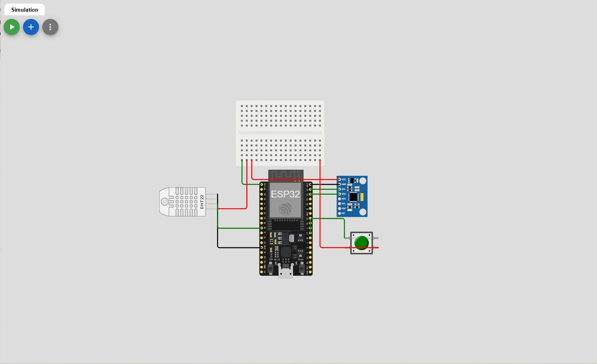
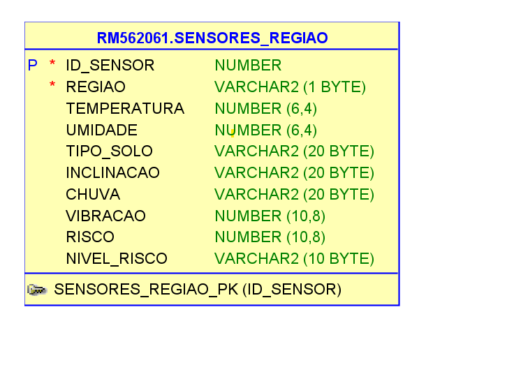
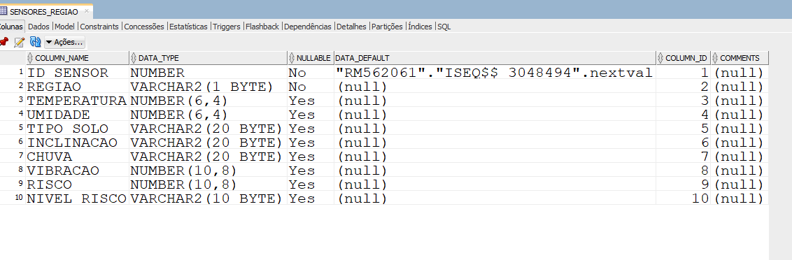
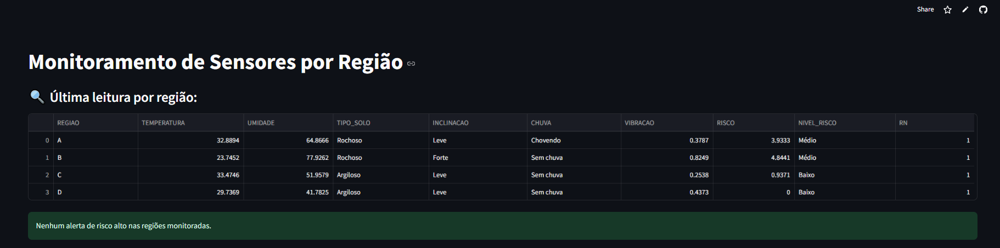
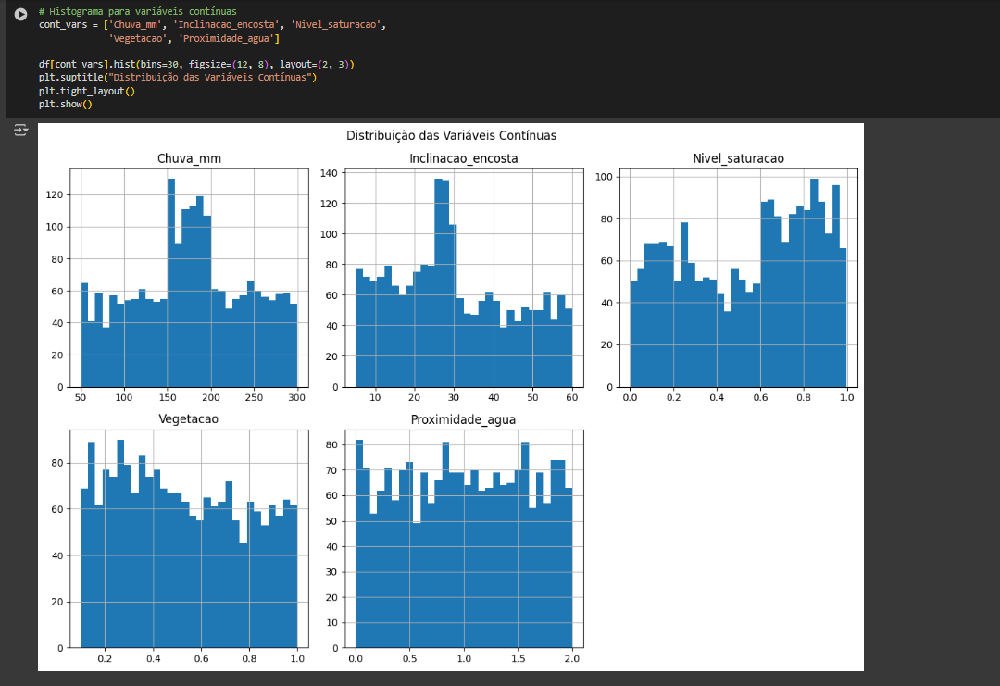
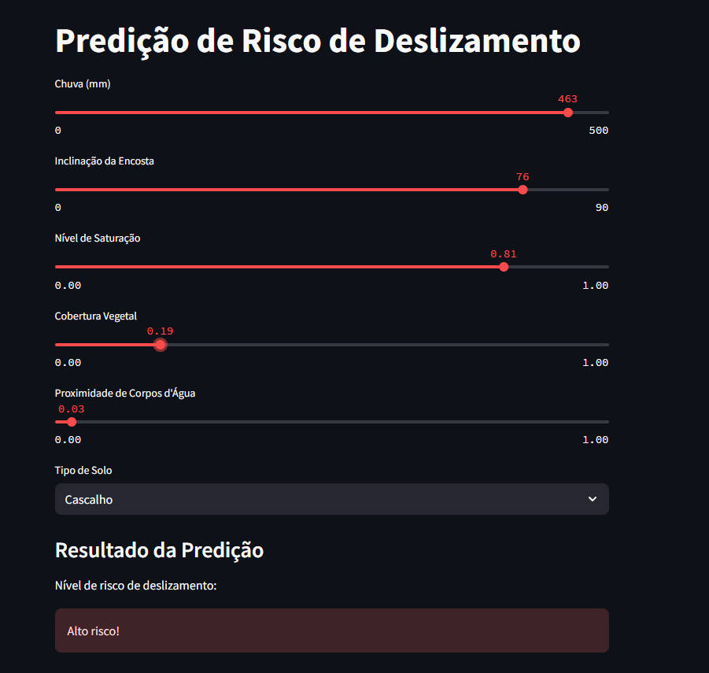

# FIAP - Faculdade de Informática e Administração Paulista

 

# Global Solution - 1º Semestre

## Nome do Grupo

- Arthur Luiz Rosado Alves -> RM562061
- Renan de Oliveira Mendes -> RM563145

## Sumário

[1. Justificativa do Problema](#c1)

[2. Descrição da Solução Proposta](#c2)

[3. Definição das Tecnologias Utilizadas](#c3)

[4. Solução Desenvolvida](#c4)

 

# 1. Justificativa do Problema

*Os deslizamentos de terra são uma ameaça ao patrimônio e à infraestrutura, especialmente no Brasil onde estima-se que 8 milhões de brasileiros vivem em áreas de risco, havendo muitas favelas, ocupação desordenada e alta ocorrência de chuvas. Esses eventos ocorrem sem aviso, resultando em tragédias. Não existem sistemas preditivos, o que dificulta a detecção riscos de deslizaamentos. Propomos uma solução tecnológica capaz de monitorar continuamente algumas variáveis causadoras de deslizamentos — como umidade, temperatura, vibrações do solo, inclinação do terreno, e intensidade das chuvas. Identificando padrões de risco e emitindo alertas preventivos.*

# 2. Descrição da Solução Proposta

A solução consiste em uma plataforma de monitoramento ambiental em tempo real, baseada na integração de sensores IoT, armazenamento em nuvem, inteligência artificial e dashboards interativos. Queremos detectar antecipadamente sinais de risco — como deslocamentos de solo, chuvas intensas e aumento de umidade. Permitindo decisões rápidas e assertivas que previnam desastres e protejam vidas.

- **Coletar dados em tempo real via sensores IoT**;

- **Armazenar os dados em um banco de dados na nuvem;**
  
- **Processamento e Tratamento dos dados;**

- **Aplicar algoritmos de machine learning para identificar padrões de instabilidade e prever possiveis deslizamentos**

- **Visualização em dashboards interativos e simplificados;**

- **Emitir alertas automaticos por aplicativo, sms ou rádio, orientando possiveis evacuações ou ações**

# Tecnologias Propostas/Planejadas

## 3 Definição das Tecnologias Utilizadas

| Camada                   | Tecnologias                                         |
|--------------------------|-----------------------------------------------------|
| **Sensoriamento**        | ESP32                                               |
| **Armazenamento**        | OracleDB                                            |
| **Backend e APIs**       | Python, tratamentos de dados e serviços.            |
| **IA / Machine Learning**| Streamlit, scikit-learn                             |
| **Infraestrutura**       | AWS ou Azure                                        |

# Pipeline de Dados

**Sensores IoT captam dados:**
- Umidade excessiva no solo;
- Vibrações sísmicas anormais;
- Inclinação do terreno (movimentações milimétricas);
- Volume de chuvas;
- Temperatura.

# 4. Solução Desenvolvida

# A Solução está separada por diretórios dentro desse repositório. Ela está totalmente funcional e documentada.

**Sensores**
- Simulação de sensores pelo Wokwi;
- Código em C, configurando e habilitando a funcionalidade dos sensores.

  

**Database_Python**
- Armazenamento dos dados no OracleDB.
- Criado a tabela, MER, DER e modelo lógico;
- Aplicação em Python de inserção automatica de dados na tabela, utilizando um arquivo .CSV;
- Aplicação em Python de Monitoramento, utilizando Streamlit;
- Link da aplicação de Monitoramento: https://globalsolution1-dzrtvby4c3n8krkph9ff9u.streamlit.app

  

  

  

**ML_Dados_Python**
- Criado uma aplicação que cria dados simulados em massa dos sensores, para fins de treinamento de modelos;
- Criado dados ficticios de sensores;
- Análise estatística, descritiva e visual dos dados;
- Criado e treinado um modelo de Machine Learning para predição de riscos de deslizamentos, utilizando os dados dos sensores.

**ML_Dados_Python**
- Utilizando dados externos, treinamos um modelo de Machine Learning que contribui para a análise de risco de deslizamento;
- Análise estastistica, descritiva e visual dos dados externos;
- Utilizando o modelo de Machine Learning criado e Streamlit, desenvolvemos uma aplicação que permite o usuário prever os riscos de deslizamento com base nas variáveis que ele detectar no ambiente.
- Link da aplicação de predição: https://globalsolution1-2nn8pxsmadkraeeuthm24b.streamlit.app

  

  

